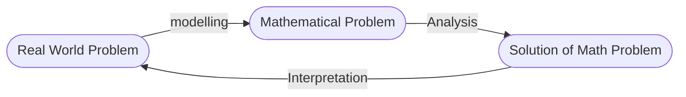

# Linear Programming (MATH484)
The following notes are for **Professor Wen Shen**'s **Penn State University** 2016 MATH484 course.
- lecture videos: https://www.youtube.com/watch?v=FdKgeeb4q3w&list=PLbxFfU5GKZz1Tm_9RR5M_uvdOXpJJ8LC3&index=1
- archived version of notes: https://misha.fish/archive/482-spring-2020

All mathematical applications follow the following cycle; A text problem from the real world needs to be solved, it is transformed using modelling into mathematical notation, which can be solved using analysis. This mathematical solution then needs to be interpreted back to a tangible, real world answer.

This course covers a specific type of mathematical problems called ***Linear Programming*** problems.
